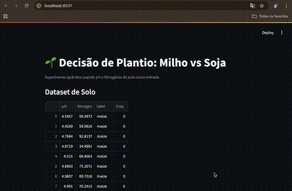

# Quantum AI Detector

Comparação simples entre modelos clássicos e quânticos para decidir plantio (Milho vs Soja) usando pH do solo como entrada. Inclui um dashboard em Streamlit, geração de dados sintéticos e integração opcional com KaggleHub.

## Visão Geral

- Objetivo: ilustrar como um circuito quântico de 1 qubit e 2 qubits pode mapear uma entrada real (pH e N) para probabilidades de decisão de plantio, comparando com um modelo clássico de limiar.
- Componentes principais:
  - `dashboards/streamlit_app.py`: interface interativa para explorar amostras e visualizar probabilidades e circuito.
  - `src/notebooks/dataset_loader.py`: carrega dataset (Kaggle ou sintético) e retorna `X`, `y`, `df`.
  - `src/notebooks/classical_model.py`: modelo clássico simples (threshold) e probabilidades.
  - `src/notebooks/quantum_model.py`: função `plant_choice_qiskit` que usa Qiskit (ou fallback) para estimar probabilidades quânticas.

## Estrutura do Projeto

- `dashboards/streamlit_app.py`: dashboard Streamlit.
- `src/notebooks/dataset_loader.py`: loader de dados (Kaggle opcional, sintético por padrão).
- `src/notebooks/classical_model.py`: modelo clássico e utilitários de probabilidade.
- `src/notebooks/quantum_model.py`: circuito quântico, `plant_choice_qiskit` e visualização textual do circuito.
- `pyproject.toml`: dependências e configuração do Poetry.
- `poetry.lock`: versões travadas das dependências.

## Requisitos

- `Python >= 3.11`
- `Poetry >= 2.0`

## Configuração do Ambiente (Poetry)

- Instalar Poetry:
  - `pipx install poetry`
  - ou: `curl -sSL https://install.python-poetry.org | python3 -`

- Usar venv no diretório do projeto (evita confusão de ambientes):
  - `poetry config virtualenvs.in-project true`

- Selecionar Python 3.11 para o virtualenv do projeto:
  - `poetry env use 3.11`

- Instalar dependências base (sem instalar o pacote raiz):
  - `poetry install --no-root`

- Extras opcionais:
  - KaggleHub (download automático de dataset):
    - `poetry install --extras data --no-root`
  - Qiskit (se quiser simulação real do circuito; pode não estar listado, usar `poetry add qiskit` caso necessário)

- Exportar `requirements.txt` (se precisar):
  - `poetry export -f requirements.txt -o requirements.txt --without-hashes`

## Execução

- Iniciar a dashboard:
  - `poetry run streamlit run dashboards/streamlit_app.py --server.port 8504`
  - Acessar em `http://localhost:8504/`

- Rodar o loader manualmente (para verificar dados):
  - `poetry run python src/notebooks/dataset_loader.py`

## Prévia do Dashboard

## Dados

- Caminho padrão do CSV: `data/crop.csv` (criado automaticamente se não existir).
- Sem KaggleHub: o loader cria um dataset sintético com formato mínimo (`pH`, `Crop`, `label`).
- Com KaggleHub: instale o extra `data` e configure credenciais do Kaggle:
  - Coloque `kaggle.json` em `~/.kaggle/kaggle.json`.
  - Permissões: `chmod 600 ~/.kaggle/kaggle.json`.
  - O loader tentará baixar o dataset configurado e salvar em `data/crop.csv`.

## Modelos

- Clássico:
  - `classical_probs(X[sample_idx:sample_idx+1])[0]` retorna probabilidades para Milho | Soja.
  - Threshold simples baseado em pH.

- Quântico (Qiskit):
  - `plant_choice_qiskit(ph_sample)` retorna `(prob_quantum, qc)` onde `prob_quantum` são probabilidades e `qc` é o circuito.
  - Se Qiskit não estiver disponível, usa um fallback analítico e `qc.draw()` retorna uma representação textual.

## Solução de Problemas

- `ModuleNotFoundError` (ex.: `pandas`, `kagglehub`):
  - Verifique se você está no venv do projeto: `poetry env info -p` deve apontar para `.../quantum-ai-detector/.venv`.
  - Sempre rode com `poetry run ...` para usar o ambiente correto.
  - Reinstale dependências no venv do projeto: `poetry install --no-root` e, se precisar, `poetry install --extras data --no-root`.

- Poetry usando outro venv (ex.: `m1-ml-book-flow-api...`):
  - Habilite venv in-project: `poetry config virtualenvs.in-project true`.
  - Remova/migre ambientes antigos e rode: `poetry install --no-root`.
  - Opcional: aponte explicitamente o Python do projeto: `poetry env use .venv/bin/python`.

- Dashboard não inicia:
  - Verifique logs do terminal onde o Streamlit está rodando.
  - Confirme imports no `dashboards/streamlit_app.py`. O arquivo ajusta `sys.path` para incluir `src/notebooks` e importa diretamente `dataset_loader`, `classical_model` e `quantum_model`.

## IDE/Editor

- Configure o interpretador para `.../quantum-ai-detector/.venv/bin/python`.
- Rode tasks e scripts sempre com `poetry run` para garantir o ambiente.

## Licença

- MIT (conforme `pyproject.toml`).
